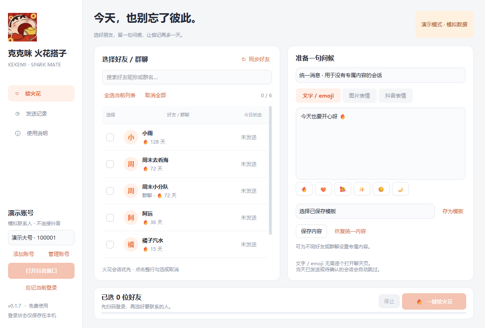

# Kekemi Spark Mate · Douyin Streak Keeper

A free Windows desktop helper for keeping in touch with selected Douyin friends. Scan a QR code, choose recipients, write a greeting, and start a one-click sending queue.

**[Download for Windows](https://github.com/kkray983681062-bit/douyin-spark-mate/releases/latest)** · [中文说明](README.md) · [Build from source](docs/BUILDING.md)

## Features

Version 0.1.7 adds saved-account switching and includes group-conversation support. Re-sync contacts after upgrading to load existing groups; newly synced groups are unselected by default.

- Official Douyin QR-code login, with locally encrypted session storage.
- Saved accounts with separate encrypted sessions, browser contexts, contacts, drafts, templates, history, and daily duplicate protection (0.1.7).
- Streak contacts first, ordered by numeric streak days; search and select entire rows.
- Custom text, emoji, local images / GIFs, and native stickers available in the web client.
- Shared templates and individual content for each friend.
- Text and emoji sent through the authenticated IM runtime without opening each recipient's chat page.
- Per-batch sending and skipped-recipient history, result filters, same-day duplicate protection, progress, and cancellation.
- Persistent login window and cancellable waits for slow connections.
- Packaged Windows x64 installer and portable ZIP; Python is not required to run them.

## Getting started

Download the installer or portable archive from [Releases](https://github.com/kkray983681062-bit/douyin-spark-mate/releases/latest). Extract the complete portable archive and keep its `_internal` folder next to the executable. Windows 10 / 11 x64 is required.

Log in by scanning the official QR code, sync existing conversations, select friends or groups, and prepare a message. Groups have a visible label and keep their own templates, history and daily duplicate protection. Start with one recipient to check the result before sending to a larger selection.

In 0.1.7, use **添加账号** (Add account) to scan each account once, then select a saved account from the sidebar. Switching requires an online identity check and never sends messages automatically. **管理账号** (Manage accounts) supports aliases, reauthentication, and forgetting a login while keeping history. Switching is unavailable during an operation. Expired sessions require a new scan; temporary network errors retain the saved login for a later retry.

## How sending works

This is a manually started queue, not a scheduled or unattended service. Text and emoji use the logged-in web IM SDK; a browser session is still required for authentication and initialization. Images and native stickers currently use the chat UI.

Confirmed sending does not mean the recipient has read the message or that a streak has been restored. Uncertain outcomes are recorded and are not automatically retried. Daily duplicate protection follows Beijing time (UTC+8).

Version 0.1.5 records who was skipped and why. Filter history by batch and result to inspect a complete batch. Skips that older versions did not record cannot be reconstructed automatically.

## Privacy and license

The application stores session data, contacts, templates, and history locally. It does not upload them to a developer-operated server. Douyin and its CDN services are contacted during normal operation. Public source and release packages exclude personal accounts, real cookies, contact lists, and chat history.

Project code is MIT licensed. Supplied artwork and dependencies retain their own rights; see [third-party notices](THIRD_PARTY_NOTICES.md). This project is not affiliated with Douyin and does not bypass login verification or platform restrictions.

Please remove account details, contact names, avatars, QR codes, private messages, cookies, and tokens before submitting an issue.
