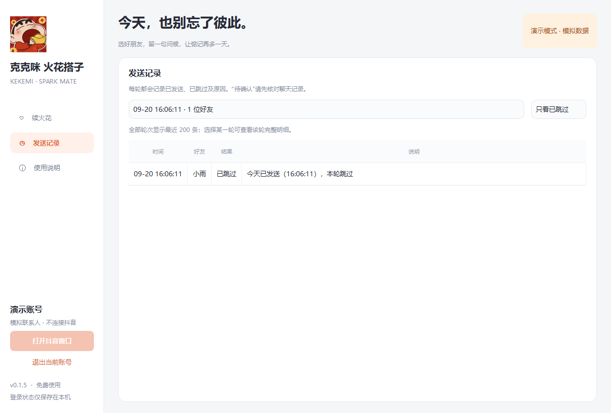

# 克克咪 火花搭子 · 抖音一键续火花

**扫码登录，自选好友，自定义文字和表情，一键给朋友续上问候。**

免费的 Windows 抖音续火花桌面软件，提供封装好的 EXE。支持火花好友优先排序、批量勾选、文字 / emoji、图片 / GIF、抖音原生表情、好友专属内容和发送记录。下载后即可使用，无需安装 Python。

**[下载 Windows 版](https://github.com/kkray983681062-bit/douyin-spark-mate/releases/latest)** · [English](README.en.md) · [完整功能](docs/FEATURES.md) · [隐私说明](docs/PRIVACY.md) · [源码构建](docs/BUILDING.md) · [更新记录](CHANGELOG.md)

Douyin streak keeper for Windows: QR-code login, selected friends, custom messages and emoji, per-friend templates, and one-click sending.

*上图为演示模式，联系人和火花天数均为模拟数据。*

*0.1.5 起可按轮次和结果查看跳过明细。旧版没有保存的跳过明细不会自动补造。*

## 下载与使用

前往 [Releases](https://github.com/kkray983681062-bit/douyin-spark-mate/releases/latest)，按需下载：

| 文件 | 用途 |
| --- | --- |
| `kekemi-spark-mate-0.1.5-windows-x64-setup.exe` | 安装版，适合直接安装使用 |
| `kekemi-spark-mate-0.1.5-windows-x64-portable.zip` | 便携版，完整解压后运行 `克克咪 火花搭子.exe` |
| `douyin-spark-mate-0.1.5-source.zip` | 对应版本源码 |
| `SHA256SUMS.txt` | 下载文件校验值 |

适用于 **Windows 10 / 11，64 位**。便携版需保留同目录的 `_internal` 文件夹。升级时先停止旧版任务并关闭程序，再打开新版；同一 Windows 用户的本地设置和历史继续沿用。

1. **扫码登录**：在抖音官方窗口使用手机扫码；如果出现验证码，由本人在该窗口完成。
2. **同步好友**：读取已有单聊联系人。有火花的好友排在前面，支持搜索，点击整行即可勾选。
3. **准备内容**：填写统一消息，也可以给某位好友单独设置内容，或使用保存的模板。
4. **一键续火花**：点击后按所选名单发送，界面显示进度与结果。可随时停止后续任务。

首次使用建议先选择一位好友，确认内容和效果后再增加收件人。

## 功能一览

| 功能 | 说明 |
| --- | --- |
| 扫码登录 | 无需在软件里输入抖音密码；登录状态由当前 Windows 用户加密保存 |
| 火花好友优先 | 有火花的好友置顶，数字天数从高到低排列，减少翻找 |
| 自选好友 | 搜索昵称、整行勾选、全选当前列表、取消选择；仅向选中的单聊好友发送 |
| 自定义消息 | 支持文字、Unicode emoji、PNG / JPG / WebP / GIF 图片和网页可读取的抖音原生表情 |
| 好友专属内容 | 统一消息与每个好友的专属消息并存，可保存、切换多个模板 |
| 文字接口发送 | 文字 / emoji 通过已登录的私信模块提交，无需逐个打开聊天页和等待聊天记录 |
| 发送记录与去重 | 保存每轮发送与跳过明细，支持按轮次、结果筛选；已发送或结果待确认的好友当天自动跳过 |
| 慢网等待 | 等待进度可见、可停止；同步超时或失败后保留登录窗口，方便继续加载和重试 |
| 本地运行 | 好友、模板和记录保存在本机；提供安装版、便携版和源码 |

## 关于“自动续火花”

本软件的“一键 / 自动续火花”指：**本人选择好友和内容，点击一次后，软件按名单自动逐个发送。** 当前版本没有定时任务、关机后发送或无人值守服务。

文字和 emoji 首次需要连接私信服务，之后通过已登录的 IM SDK 发送。**登录窗口仍需保留**；完全不依赖浏览器的后端尚未实现。图片和抖音原生表情目前仍通过聊天页发送。

“已发送”表示获得可核对的消息发送确认，不代表对方已读，也不保证火花已经点亮。火花状态以抖音显示为准。结果不明时显示“待确认”，不会自动重发，请先查看聊天记录。原生表情范围及 GIF 动画效果取决于抖音当前网页支持情况。

## 隐私与开源

- 登录凭据、好友、消息模板和发送记录保存在本机，不上传到开发者服务器。
- 登录与发送会连接抖音及其相关服务，头像等资源会访问相应 CDN。
- 公开仓库和发行包不包含真实 Cookie、登录态、好友名单、聊天内容或开发者本机账号数据；测试使用虚构数据。
- 项目自有代码采用 [MIT License](LICENSE)。图标素材和第三方组件保留各自权利，详见 [第三方说明](THIRD_PARTY_NOTICES.md)。

本项目与抖音官方无隶属关系。扫码、验证码及平台限制均以官方页面为准，软件不提供绕过验证的功能。请用于自己有权操作的账号和正常好友互动。

## 开发与反馈

源码使用 **Python 3.11 + PySide6 + Playwright + SQLite**。开发运行、测试及 Windows 打包步骤见 [构建说明](docs/BUILDING.md)。

遇到问题可 [提交 Issue](https://github.com/kkray983681062-bit/douyin-spark-mate/issues)。请写明软件版本、复现步骤和错误提示；提交截图前遮住好友昵称、头像、私信内容、二维码和账号信息，勿上传本地登录文件或数据库。

## 检索关键词

中文：**抖音一键续火花、抖音续火花、抖音自动续火花、续火花软件、续火花工具、火花搭子、克克咪、扫码登录、自定义表情、自定义消息、好友批量选择、Windows EXE、免费开源。**

English: Douyin streak keeper, Douyin spark, one-click messaging, QR-code login, custom emoji, desktop app, Windows, Python, PySide6, Playwright.

参考与实现边界见 [功能说明](docs/FEATURES.md)。
